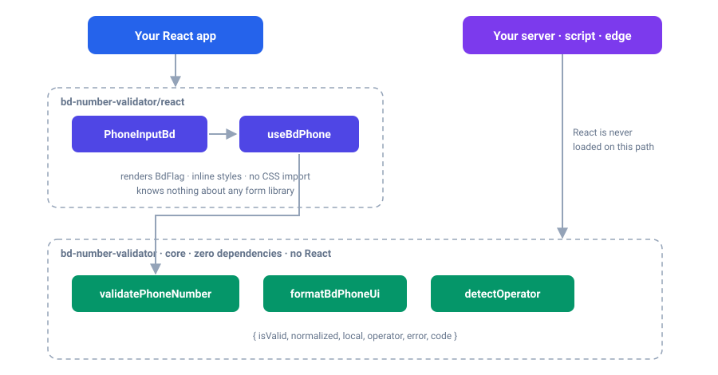
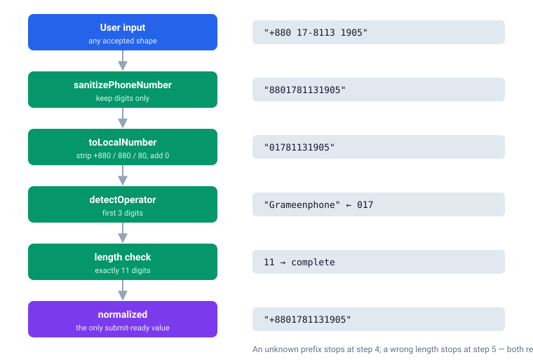
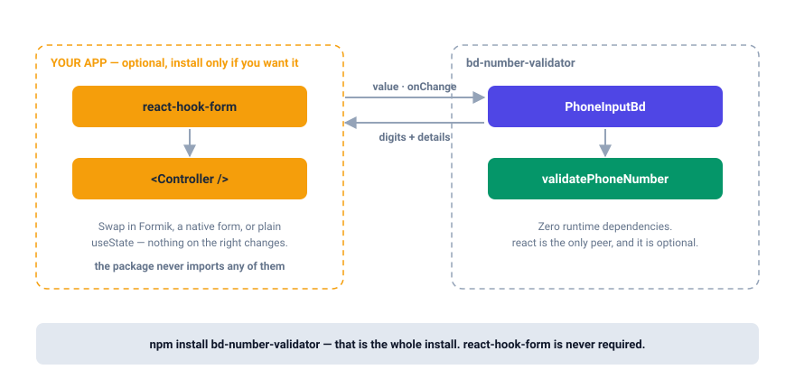
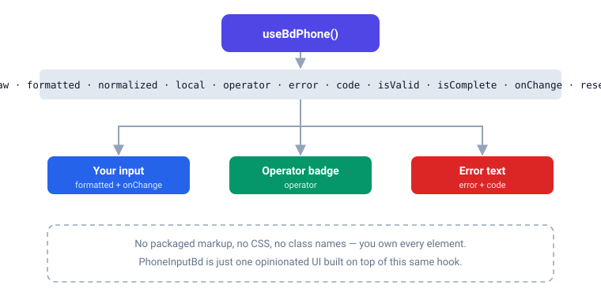

# bd-number-validator

**Bangladesh mobile number validation, normalization and operator detection — plus an optional React input that needs no CSS file and no form library.**

[](https://www.npmjs.com/package/bd-number-validator)
[](https://opensource.org/licenses/MIT)
[](#typescript)

```bash
npm install bd-number-validator
```

That is the entire install. No `react-hook-form`, no Tailwind, no PostCSS, no
stylesheet import, **no runtime dependencies at all**.

---

## Why

Bangladeshi users type their number in at least five shapes — `01781131905`,
`1781131905`, `8801781131905`, `+8801781131905`, `017-8113 1905`. Your database
wants exactly one: `+8801781131905`.

This package closes that gap with one pure function, and — if you use React —
one drop-in input built on top of it.

- **Framework-free core.** `validatePhoneNumber` runs in Node, the browser, edge
  runtimes and workers. It never imports React.
- **Optional React layer.** `PhoneInputBd` + `useBdPhone`, in a separate entry.
- **No CSS import.** Styles ship inline; every slot is overridable.
- **No form library coupling.** It is a plain controlled input — React Hook
  Form, Formik, a native `<form>` or `useState` all work identically.
- **Accessible by default.** Label association, `aria-invalid`,
  `aria-describedby`, `role="alert"`, `inputMode`, `autoComplete`.
- **TypeScript-first.** Every public type is exported.

---

## Table of contents

- [Quick start](#quick-start) · [Architecture](#architecture) · [How validation works](#how-validation-works)
- [Core API](#core-api) · [React API](#react-api) · [Styling](#styling)
- [Form libraries](#form-libraries) · [Custom UI](#custom-ui) · [Server-side](#server-side-usage)
- [Accessibility](#accessibility) · [TypeScript](#typescript) · [API reference](#api-reference)
- [Supported formats](#supported-input-formats) · [Limitations](#limitations) · [Migrating from v1](#migrating-from-v1)

---

## Quick start

### Validate anywhere

```ts
import { validatePhoneNumber } from "bd-number-validator";

const result = validatePhoneNumber("+880 17-8113 1905");

result.normalized; // "+8801781131905"
result.local;      // "01781131905"
result.operator;   // "Grameenphone"
result.isValid;    // true
```

### React input

```tsx
import { useState } from "react";
import { PhoneInputBd } from "bd-number-validator/react";

export default function SignUp() {
  const [phone, setPhone] = useState("");

  return (
    <PhoneInputBd
      label="Mobile number"
      value={phone}
      onChange={setPhone}
    />
  );
}
```

No `import "…/style.css"`. The component renders a Bangladesh flag, a `+880`
prefix and a field that displays `017 8113 1905` while keeping `phone` as
digits-only `01781131905`.

---

## Architecture



Two entry points, one direction of dependency:

| Import | Contains | Needs React |
| --- | --- | --- |
| `bd-number-validator` | validation, normalization, formatting, operators | no |
| `bd-number-validator/validate` | alias of the above, for server code that wants the intent to be obvious | no |
| `bd-number-validator/react` | `PhoneInputBd`, `BdFlag`, `useBdPhone` **+ everything from the core** | yes |

The core never imports React, so a backend bundle stays React-free. In a React
app you only ever need the `/react` import — it re-exports the core too.

---

## How validation works



### The one rule worth knowing

`isValid` is **progressive**. While the user is still typing, an empty or
half-finished number is reported as `isValid: true` so your form does not flash
red on the first keystroke.

> **`normalized` — not `isValid` — is the proof of a complete number.**

```ts
// ❌ accepts an empty field
if (validatePhoneNumber(phone).isValid) submit();

// ✅ submit-ready
const result = validatePhoneNumber(phone);
if (result.normalized) submit(result.normalized);

// ✅ or ask for strict mode, which rejects empty and partial input
const strict = validatePhoneNumber(phone, { strict: true });
if (!strict.isValid) showError(strict.error);
```

Shortcut for the common case:

```ts
import { isValidPhoneNumber } from "bd-number-validator";

isValidPhoneNumber("01781131905"); // true
isValidPhoneNumber("017");         // false
isValidPhoneNumber("");            // false
```

---

## Core API

### `validatePhoneNumber(input, options?)`

```ts
validatePhoneNumber("01781131905");
// {
//   isValid: true,
//   normalized: "+8801781131905",
//   local: "01781131905",
//   operator: "Grameenphone"
// }

validatePhoneNumber("01211111111");
// { isValid: false, operator: "Unknown", code: "INVALID_OPERATOR", error: "Invalid operator" }

validatePhoneNumber("0178113");
// { isValid: false, operator: "Grameenphone", code: "INCOMPLETE", error: "Invalid number" }

validatePhoneNumber("", { strict: true });
// { isValid: false, code: "EMPTY", error: "Phone number is required" }
```

**Options**

| Option | Type | Default | Description |
| --- | --- | --- | --- |
| `strict` | `boolean` | `false` | Reject empty and partially typed input. Use at submit time. |
| `allowEmpty` | `boolean` | `false` | With `strict`, still accept an empty value (optional fields). |

**Result**

| Field | Type | Present when |
| --- | --- | --- |
| `isValid` | `boolean` | always |
| `normalized` | `string \| undefined` | the number is complete and valid → `"+8801XXXXXXXXX"` |
| `local` | `string \| undefined` | the number is complete and valid → `"01XXXXXXXXX"` |
| `operator` | `Operator \| undefined` | three or more digits are known |
| `error` | `string \| undefined` | `isValid` is `false` |
| `code` | `PhoneValidationCode \| undefined` | the number is not complete and valid |

**Codes:** `"EMPTY"` · `"INCOMPLETE"` · `"INVALID_OPERATOR"` · `"INVALID_LENGTH"`

### Other core helpers

```ts
import {
  isValidPhoneNumber,   // (input) => boolean
  normalizePhoneNumber, // (input) => "+8801781131905" | undefined
  formatBdPhoneUi,      // ("01781131905") => "017 8113 1905"
  sanitizePhoneNumber,  // ("+880 17-8113") => "880178113"
  toLocalNumber,        // ("+8801781131905") => "01781131905"
  toInputDigits,        // keystroke-safe variant used by the input
  detectOperator,       // ("01781131905") => "Grameenphone"
  OPERATOR_PREFIXES,    // { Grameenphone: ["017", "013"], … }
  KNOWN_PREFIXES,       // ["017", "013", "019", …]
  LOCAL_NUMBER_LENGTH,  // 11
  COUNTRY_CODE,         // "+880"
} from "bd-number-validator";
```

### `formatBdPhoneUi(input)`

Display grouping only — the stored value stays digits-only.

| Digits | Displayed |
| --- | --- |
| `017` | `017` |
| `0178113` | `017 8113` |
| `01781131905` | `017 8113 1905` |

---

## React API

### `<PhoneInputBd />`

Controlled, uncontrolled, or anywhere in between.

```tsx
// Controlled — you own the state
const [phone, setPhone] = useState("");
<PhoneInputBd value={phone} onChange={setPhone} />

// Uncontrolled — the component owns it
<PhoneInputBd defaultValue="01781131905" />
```

`value` is genuinely controlled: change it from outside and the field follows.
`defaultValue` seeds an uncontrolled field once and is ignored afterwards.

#### What `onChange` gives you

```tsx
<PhoneInputBd
  value={phone}
  onChange={(value, details) => {
    value;              // "01781131905"     ← digits, feed straight back into `value`
    details.formatted;  // "017 8113 1905"   ← what the user sees
    details.normalized; // "+8801781131905"  ← undefined until complete
    details.operator;   // "Grameenphone"
    details.isValid;    // true
    details.code;       // undefined | "INCOMPLETE" | …
  }}
/>
```

The first argument is **always the digits**, never the formatted string — so
`onChange={setPhone}` round-trips correctly. The canonical `+880…` value lives
on `details.normalized`.

| Value | Example | Where |
| --- | --- | --- |
| Display value | `017 8113 1905` | inside the `<input>`, and `details.formatted` |
| Stored value | `01781131905` | first `onChange` argument, and the `value` prop |
| Normalized value | `+8801781131905` | `details.normalized` — submit this |

### `useBdPhone(options?)`

The same logic, without any markup.

```tsx
const phone = useBdPhone({ defaultValue: "01781131905" });

phone.raw;        // "01781131905"
phone.formatted;  // "017 8113 1905"
phone.normalized; // "+8801781131905"
phone.operator;   // "Grameenphone"
phone.error;      // undefined
phone.isValid;    // true
phone.isComplete; // true
phone.onChange("019 1111 1111");
phone.reset();
```

Controlled usage works here too: `useBdPhone({ value, onChange: setValue })`.

---

## Styling

The component ships its styles **inline**, so it looks right the moment you
render it and it can never leak rules into your app. There are three ways to
change how it looks, and you can mix them freely.

### 1. `styles` — per-slot style objects

```tsx
<PhoneInputBd
  value={phone}
  onChange={setPhone}
  styles={{
    input: { fontSize: 16 },
    inputWrapper: { borderRadius: 12 },
  }}
/>
```

Any slot may also be a function of the live state:

```tsx
<PhoneInputBd
  styles={{
    inputWrapper: ({ hasError, isFocused }) => ({
      borderColor: hasError ? "#ef4444" : isFocused ? "#2563eb" : "#d1d5db",
      boxShadow: isFocused ? "0 0 0 3px rgba(37,99,235,0.15)" : "none",
    }),
  }}
/>
```

The state object is `{ isValid, hasError, isFocused, isDisabled, isReadOnly, isComplete }`.

### 2. `classNames` — per-slot classes (Tailwind, CSS modules, anything)

```tsx
<PhoneInputBd
  className="mb-4"
  classNames={{
    label: "block text-sm font-medium text-gray-700 mb-2",
    inputWrapper:
      "flex items-center gap-2 rounded-lg border border-gray-300 px-3 py-2 focus-within:ring-2",
    flag: "w-6 h-4",
    prefix: "text-gray-600 font-medium",
    input: "flex-1 outline-none text-gray-900",
    error: "text-sm text-red-600 mt-1",
  }}
  unstyled
/>
```

`unstyled` drops every built-in style so your classes start from zero.
`className` goes on the outer container.

### 3. CSS custom properties — theme without touching props

Every variable, with the built-in default:

```css
.signup-form {
  /* shape */
  --phone-input-bd-height: 36px; /* shadcn h-9 */
  --phone-input-bd-padding: 7px 12px; /* shadcn px-3 */
  --phone-input-bd-radius: 8px; /* shadcn rounded-md */
  --phone-input-bd-gap: 8px; /* label -> field -> message */
  --phone-input-bd-inner-gap: 8px; /* flag -> prefix -> value */
  --phone-input-bd-font-size: 14px; /* shadcn text-sm */
  --phone-input-bd-line-height: 1.4285714;

  /* colour */
  --phone-input-bd-bg: transparent;
  --phone-input-bd-color: #0a0a0a; /* --foreground */
  --phone-input-bd-label-color: #0a0a0a; /* --foreground */
  --phone-input-bd-prefix-color: #737373; /* --muted-foreground */
  --phone-input-bd-border: #e5e5e5; /* --input */
  --phone-input-bd-border-focus: #a1a1a1; /* --ring */
  --phone-input-bd-border-error: #e7000b; /* --destructive */
  --phone-input-bd-error-color: #e7000b; /* --destructive */
  --phone-input-bd-ring: rgba(161, 161, 161, 0.5); /* ring-ring/50 */
  --phone-input-bd-ring-error: rgba(231, 0, 11, 0.2); /* ring-destructive/20 */
  --phone-input-bd-shadow: 0 1px 2px 0 rgb(0 0 0 / 0.05); /* shadow-xs */
}
```

The full list is exported as `CSS_VARIABLES`.

### shadcn/ui

The defaults **are** shadcn's: the field is `h-9` (36px), `rounded-md`, `px-3`,
`text-sm`, `border-input`, `shadow-xs`, with a 3px `ring-ring/50` on focus and
`ring-destructive/20` plus a red label when the number is invalid. Dropped into
a shadcn form next to `<Input />` it lines up on every edge with nothing to
configure.

To follow a **custom shadcn theme** — a different base colour, a different
`--radius`, or dark mode — map the tokens once and the component tracks your
theme everywhere, light and dark:

```css
:root {
  --phone-input-bd-height: 2.25rem;
  --phone-input-bd-radius: calc(var(--radius) - 2px);
  --phone-input-bd-bg: transparent;
  --phone-input-bd-color: var(--foreground);
  --phone-input-bd-label-color: var(--foreground);
  --phone-input-bd-prefix-color: var(--muted-foreground);
  --phone-input-bd-border: var(--input);
  --phone-input-bd-border-focus: var(--ring);
  --phone-input-bd-border-error: var(--destructive);
  --phone-input-bd-error-color: var(--destructive);
  --phone-input-bd-ring: color-mix(in oklab, var(--ring) 50%, transparent);
  --phone-input-bd-ring-error: color-mix(
    in oklab,
    var(--destructive) 20%,
    transparent
  );
}

.dark {
  --phone-input-bd-bg: color-mix(in oklab, var(--input) 30%, transparent);
}
```

Prefer Tailwind classes over variables? `unstyled` plus `classNames` gives you
the shadcn `Input` string verbatim — see the `classNames` example above.

**Height.** The control is `36px` because its line box is exactly `20px`
(`14px` × `1.4285714`, Tailwind's `text-sm`) plus `7px` of padding and a `1px`
border. The prefix and the value share that line box, so they sit on one
baseline and the row never shifts with the host page's own `line-height`. For a
different control height, move `--phone-input-bd-height` and
`--phone-input-bd-padding` together:

```css
/* 40px field */
.signup-form {
  --phone-input-bd-height: 40px;
  --phone-input-bd-padding: 9px 12px;
}
```

### Slots

`container` · `label` · `inputWrapper` · `flag` · `prefix` · `input` · `error` —
the same seven names in `styles` and in `classNames`.

### The flag

`BdFlag` is an inline SVG drawn to the official proportions (10:6 field, disc
radius ⅕ of the length, centered at ⁹⁄₂₀). No image request, no asset file, no
stylesheet. Replace or remove it freely:

```tsx
<PhoneInputBd flag={} />
<PhoneInputBd flag={null} prefix={null} />
<BdFlag width={24} height={15} title="Bangladesh" />
```

---

## Form libraries



> **React Hook Form is not required by this package.** It is not a dependency,
> not a peer dependency, and not bundled. `PhoneInputBd` is a plain controlled
> input — anything that can hand it a `value` and an `onChange` works.

### React Hook Form

```tsx
import { Controller, useForm } from "react-hook-form";
import { PhoneInputBd } from "bd-number-validator/react";
import { validatePhoneNumber } from "bd-number-validator";

export function Form() {
  const { control, handleSubmit } = useForm({ defaultValues: { phone: "" } });

  return (
    <form onSubmit={handleSubmit((values) => console.log(values))}>
      <Controller
        name="phone"
        control={control}
        rules={{
          validate: (value) => {
            const result = validatePhoneNumber(value ?? "", { strict: true });
            return result.isValid || result.error || "Invalid phone number";
          },
        }}
        render={({ field, fieldState }) => (
          <PhoneInputBd
            label="Mobile number"
            value={field.value}
            onChange={field.onChange}
            onBlur={field.onBlur}
            name={field.name}
            error={fieldState.error?.message}
          />
        )}
      />
      <button type="submit">Continue</button>
    </form>
  );
}
```

Passing `error` hands the message display over to your form library. Convert to
the canonical form on submit with `validatePhoneNumber(values.phone).normalized`.

### Formik

```tsx
<Formik initialValues={{ phone: "" }} onSubmit={console.log}>
  {({ values, setFieldValue, errors }) => (
    <PhoneInputBd
      value={values.phone}
      onChange={(value) => setFieldValue("phone", value)}
      error={errors.phone}
    />
  )}
</Formik>
```

### Native form

```tsx
function NativeForm() {
  const [phone, setPhone] = useState("");

  return (
    <form
      onSubmit={(event) => {
        event.preventDefault();
        const result = validatePhoneNumber(phone, { strict: true });
        if (!result.normalized) return alert(result.error);
        fetch("/api/signup", {
          method: "POST",
          body: JSON.stringify({ phone: result.normalized }),
        });
      }}
    >
      <PhoneInputBd name="phone" required value={phone} onChange={setPhone} />
      <button type="submit">Sign up</button>
    </form>
  );
}
```

### Any other state manager

Zustand, Redux, Jotai, a reducer — it is the same `{ value, onChange }` pair.

---

## Custom UI



If you do not want the packaged markup, skip it. `useBdPhone` gives you the
whole state machine and no DOM.

```tsx
import { useBdPhone } from "bd-number-validator/react";

export function MyPhoneField() {
  const phone = useBdPhone();

  return (
    <div>
      <input
        value={phone.formatted}
        onChange={(event) => phone.onChange(event.target.value)}
        placeholder="017 8113 1905"
        inputMode="numeric"
        autoComplete="tel"
      />

      {phone.operator && <span className="badge">{phone.operator}</span>}
      {phone.error && <p className="error">{phone.error}</p>}
      {phone.isComplete && <small>Will submit {phone.normalized}</small>}
    </div>
  );
}
```

Or go one level lower and use the core functions on your own state — the hook is
a convenience, not a requirement.

---

## Server-side usage

The root entry has no React in it, so this adds nothing React-shaped to a server
bundle.

### Express

```js
import express from "express";
import { validatePhoneNumber } from "bd-number-validator/validate";

const app = express();

app.post("/api/otp", express.json(), (req, res) => {
  const result = validatePhoneNumber(req.body.phone ?? "", { strict: true });

  if (!result.normalized) {
    return res.status(400).json({ error: result.error, code: result.code });
  }

  sendOtp(result.normalized);
  res.json({ ok: true, operator: result.operator });
});
```

### Next.js route handler

```ts
import { NextResponse } from "next/server";
import { validatePhoneNumber } from "bd-number-validator";

export async function POST(request: Request) {
  const { phone } = await request.json();
  const result = validatePhoneNumber(phone ?? "", { strict: true });

  if (!result.normalized) {
    return NextResponse.json({ error: result.error }, { status: 400 });
  }

  return NextResponse.json({ phone: result.normalized });
}
```

### Bulk cleanup

```ts
const cleaned = rows
  .map((row) => normalizePhoneNumber(row.phone))
  .filter((value): value is string => value !== undefined);
```

---

## Accessibility

`PhoneInputBd` is wired for assistive technology out of the box:

- The `label` is a real `<label htmlFor>` bound to the input; an auto-generated
  `id` is used unless you pass one.
- The error message carries `role="alert"` and is linked through
  `aria-describedby`. A caller-supplied `aria-describedby` is preserved and the
  error id is appended.
- `aria-invalid="true"` is set whenever an error is shown, so the state is not
  communicated by color alone.
- `type="tel"`, `inputMode="numeric"` and `autoComplete="tel"` by default —
  correct mobile keyboard, correct autofill. Both are overridable.
- `disabled`, `readOnly`, `required`, `name`, `onFocus`, `onBlur` and every
  other native input attribute are forwarded to the `<input>`.
- `ref` is forwarded to the underlying `<input>`.
- `BdFlag` is decorative by default (`aria-hidden`) and becomes an
  `role="img"` with a `<title>` when you pass one.

```tsx
<PhoneInputBd
  id="phone"
  name="phone"
  label="Mobile number"
  aria-describedby="phone-hint"
  required
  value={phone}
  onChange={setPhone}
/>
<p id="phone-hint">We only use this for delivery updates.</p>
```

---

## TypeScript

Types ship with the package — nothing to install.

```ts
import type {
  Operator,               // "Grameenphone" | "Banglalink" | … | "Unknown"
  KnownOperator,          // the same without "Unknown"
  PhoneValidationResult,
  PhoneValidationCode,
  ValidatePhoneNumberOptions,
} from "bd-number-validator";

import type {
  PhoneInputBdProps,
  PhoneInputBdStyles,
  PhoneInputBdClassNames,
  PhoneInputBdState,
  PhoneInputBdSlot,
  PhoneInputBdStyleValue,
  PhoneChangeDetails,
  UseBdPhoneOptions,
  UseBdPhoneReturn,
  BdFlagProps,
} from "bd-number-validator/react";
```

Verified against `moduleResolution` `bundler`, `node16` and `node` (classic).

---

## API reference

### Exports

| API | Kind | Entry | Purpose |
| --- | --- | --- | --- |
| `validatePhoneNumber` | function | core | Validate, normalize and identify a number |
| `isValidPhoneNumber` | function | core | `boolean` shortcut for a complete number |
| `normalizePhoneNumber` | function | core | `"+8801…"` or `undefined` |
| `formatBdPhoneUi` | function | core | Display grouping `017 8113 1905` |
| `sanitizePhoneNumber` | function | core | Strip everything but digits |
| `toLocalNumber` | function | core | Canonical `01XXXXXXXXX` form |
| `toInputDigits` | function | core | Keystroke-safe digits for an input field |
| `detectOperator` | function | core | Operator from a local number |
| `OPERATOR_PREFIXES` | const | core | Prefix table by operator |
| `KNOWN_PREFIXES` | const | core | Flat list of accepted prefixes |
| `LOCAL_NUMBER_LENGTH` | const | core | `11` |
| `COUNTRY_CODE` | const | core | `"+880"` |
| `PhoneInputBd` | component | react | Ready-to-use input |
| `BdFlag` | component | react | Inline Bangladesh flag SVG |
| `useBdPhone` | hook | react | Headless state + validation |
| `CSS_VARIABLES` | const | react | Names of the supported CSS custom properties |
| `getDefaultStyles` | function | react | The built-in style objects, for extending |
| `resolveStyle` | function | react | Resolve a style value against a state |

### `<PhoneInputBd />` props

#### Value

| Prop | Type | Default | Description |
| --- | --- | --- | --- |
| `value` | `string` | — | Controlled digits. Any accepted shape is normalized on the way in. |
| `defaultValue` | `string` | `""` | Initial value for uncontrolled usage. |
| `onChange` | `(value: string, details: PhoneChangeDetails) => void` | — | Digits first, full validation details second. |

#### Content

| Prop | Type | Default | Description |
| --- | --- | --- | --- |
| `label` | `ReactNode` | — | Label content. Omit for no label. |
| `error` | `ReactNode` | — | Replaces the built-in message. `null`/`false` suppresses it. |
| `showError` | `boolean` | `true` | Allow the built-in validation message. |
| `flag` | `ReactNode` | `<BdFlag />` | Custom flag, or `null` to hide. |
| `prefix` | `ReactNode` | `"+880"` | Custom prefix, or `null` to hide. |

#### Appearance

| Prop | Type | Default | Description |
| --- | --- | --- | --- |
| `className` | `string` | — | Class for the outer container. |
| `classNames` | `PhoneInputBdClassNames` | `{}` | Per-slot classes. |
| `styles` | `PhoneInputBdStyles` | `{}` | Per-slot style objects or state functions. |
| `unstyled` | `boolean` | `false` | Drop every built-in style. |

#### Native

Everything else is forwarded to the `<input>`: `id`, `name`, `placeholder`
(default `"017 8113 1905"`), `disabled`, `readOnly`, `required`, `autoComplete`
(default `"tel"`), `inputMode` (default `"numeric"`), `onFocus`, `onBlur`,
`aria-*`, `data-*`, and `ref`.

`type` is fixed to `"tel"`. `style` and the native `prefix` attribute are
replaced by the `styles` and `prefix` props above.

### `useBdPhone(options?)`

| Option | Type | Description |
| --- | --- | --- |
| `value` | `string` | Controlled value. |
| `defaultValue` | `string` | Uncontrolled initial value. |
| `onChange` | `(value: string, details: PhoneChangeDetails) => void` | Change callback. |

| Returns | Type | Description |
| --- | --- | --- |
| `raw` | `string` | Digits currently entered. |
| `formatted` | `string` | `017 8113 1905`. |
| `normalized` | `string \| undefined` | `+8801781131905` once complete. |
| `local` | `string \| undefined` | `01781131905` once complete. |
| `operator` | `Operator \| undefined` | From three digits onwards. |
| `error` | `string \| undefined` | Current message, if any. |
| `code` | `PhoneValidationCode \| undefined` | Machine-readable status. |
| `isValid` | `boolean` | Acceptable so far. |
| `isComplete` | `boolean` | Complete and valid — safe to submit. |
| `onChange` | `(value: string) => void` | Update the value. |
| `reset` | `() => void` | Clear the value. |

---

## Supported input formats

| Input | Normalized | Valid |
| --- | --- | --- |
| `01781131905` | `+8801781131905` | ✅ |
| `1781131905` | `+8801781131905` | ✅ |
| `8801781131905` | `+8801781131905` | ✅ |
| `+8801781131905` | `+8801781131905` | ✅ |
| `017 8113-1905` | `+8801781131905` | ✅ |
| `(017) 8113.1905` | `+8801781131905` | ✅ |
| `01211111111` | — | ❌ `INVALID_OPERATOR` |
| `0178113190` (10 digits) | — | ❌ `INCOMPLETE` |
| `017811319055` (12 digits) | — | ❌ `INVALID_LENGTH` |
| `""` | — | ❌ `EMPTY` (accepted in non-strict mode) |

### Operators

| Operator | Prefixes |
| --- | --- |
| Grameenphone | `017`, `013` |
| Banglalink | `019`, `014` |
| Robi | `018` |
| Airtel | `016` |
| Teletalk | `015` |

Exported as `OPERATOR_PREFIXES` if you need the table at runtime.

---

## Limitations

- **Mobile numbers only.** Landline / PSTN numbers such as `02…` are rejected.
- **Format validation, not delivery.** A well-formed number is not proof of an
  active SIM. Send an OTP for that.
- **Number portability.** A ported number keeps the prefix of the operator that
  issued it, so `operator` reflects the issuing network, not necessarily the one
  serving the number today.
- **Bangladesh only.** For international numbers use `libphonenumber-js`.
- **Latin digits only.** Bengali numerals (`০১৭`) are not interpreted.

---

## Migrating from v1

v2 is a breaking release: names, entry points and the styling model all changed.
`validatePhoneNumber` itself is unchanged — its old result fields all still
behave the same way, with `local` and `code` added.

| v1 | v2 |
| --- | --- |
| `import { BDPhoneInput } from "bd-number-validator"` | `import { PhoneInputBd } from "bd-number-validator/react"` |
| `import { useBDPhone } from "bd-number-validator"` | `import { useBdPhone } from "bd-number-validator/react"` |
| `import "bd-number-validator/react/style.css"` | **delete this line** — styles are inline now |
| `<BDPhoneInput onValueChange={setPhone} />` | `<PhoneInputBd onChange={(v, d) => setPhone(d.normalized)} />` |
| `value` (behaved as an initial value) | `defaultValue`, or `value` for real controlled usage |
| `useBDPhone("01781131905")` | `useBdPhone({ defaultValue: "01781131905" })` |
| `containerClass` / `wrapperClass` / `inputClass` / … | `classNames={{ container, inputWrapper, input, … }}` |
| `renderFlag` / `renderPrefix` | `flag={…}` / `prefix={…}` |
| `renderLabel` / `showLabel` | `label={<YourNode />}`; omit `label` to hide it |
| `renderError` | `error={<YourNode />}` |
| `.bdp-*` CSS classes | removed — use `styles`, `classNames` or the CSS variables |
| `label` defaulted to `"Phone Number"` | no label unless you pass one |

`validatePhoneNumber` keeps working from the root import with no changes.

---

## Contributing

```bash
npm install
npm run typecheck   # tsc --noEmit
npm test            # vitest — 137 tests
npm run build       # tsup → dist/
```

Keep `src/core/` free of React and DOM imports. New operator prefixes need a
BTRC-citable source in the pull request.

---

## License

MIT © [Muhammad Rashed](https://github.com/mrashed21)
